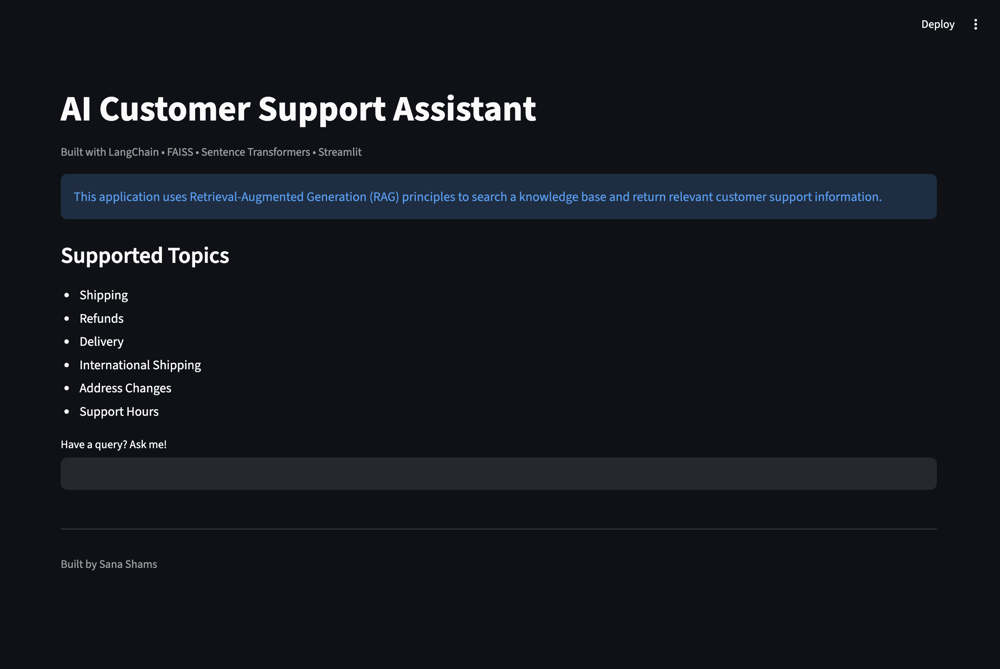

# 🤖 AI Customer Support Assistant

**Designed and Developed by Sana Shams**

## 📸 Application Preview



A Retrieval-Augmented Generation (RAG) based customer support assistant built using LangChain, FAISS, Sentence Transformers, and Streamlit.

The application enables users to ask customer support questions in natural language and retrieves the most relevant information from a knowledge base using semantic search and vector embeddings.

---

## 🚀 Features

* Semantic search using vector embeddings
* FAISS vector database for efficient retrieval
* Document chunking and indexing using LangChain
* Interactive Streamlit web interface
* Knowledge-base driven responses
* Source attribution for retrieved answers
* Fast and scalable retrieval pipeline
* Clean and responsive UI
* Ready for LLM integration (Llama 3 / OpenAI)

---

## 🏗️ Architecture

```text
User Question
      │
      ▼
Streamlit Interface
      │
      ▼
LangChain Retriever
      │
      ▼
FAISS Vector Store
      │
      ▼
Relevant Knowledge Chunks
      │
      ▼
Response Display
```

---

## 🛠️ Tech Stack

* Python
* LangChain
* FAISS
* Sentence Transformers
* Hugging Face Embeddings
* Streamlit

---

## 📚 Supported Topics

* Shipping
* Refunds
* Delivery
* International Shipping
* Address Changes
* Support Hours

---

## 📂 Project Structure

```text
ai-customer-support-assistant/
│
├── docs/
│   └── company_faq.txt
│
├── vectorstore/
│   ├── index.faiss
│   └── index.pkl
│
├── screenshot.png
├── app.py
├── ingest.py
├── query.py
├── requirements.txt
├── README.md
└── .gitignore
```

---

## ⚙️ How It Works

### 1. Knowledge Base Creation

Customer support FAQs are stored inside:

```text
docs/company_faq.txt
```

### 2. Document Processing

LangChain loads the FAQ document and splits it into manageable chunks.

### 3. Embedding Generation

Sentence Transformers converts each text chunk into vector embeddings.

### 4. Vector Storage

FAISS stores the embeddings for efficient semantic retrieval.

### 5. User Query

Users submit questions through the Streamlit interface.

### 6. Retrieval

The retriever finds the most relevant document chunks based on semantic similarity.

### 7. Response Generation

The application returns the most relevant answer and displays supporting source documents.

---

## ▶️ Running the Application

### Install Dependencies

```bash
pip install -r requirements.txt
```

### Create the Vector Database

```bash
python ingest.py
```

### Launch the Streamlit Application

```bash
streamlit run app.py
```

---

## 🔮 Future Enhancements

* Llama 3 integration using Ollama
* OpenAI API integration
* Conversational memory
* Chat-style user interface
* PDF document ingestion
* Multi-document knowledge base
* Confidence scoring for retrieved answers
* Conversation history tracking

---

## 👨‍💻 Author

**Sana Shams**

Built as a hands-on Generative AI project to demonstrate Retrieval-Augmented Generation (RAG), semantic search, vector databases, and modern AI application development using LangChain, FAISS, and Streamlit.
